class: middle, center, title-slide
count: false

# `pyhf` Roadmap for IRIS-HEP Execution Phase

<br>

.huge.blue[Matthew Feickert]<br>
.huge[(University of Illinois at Urbana-Champaign)]
.center.width-5[[](https://physics.illinois.edu/)]<br>
<br>
[matthew.feickert@cern.ch](mailto:matthew.feickert@cern.ch)

[2020 IRIS-HEP Institute Retreat](https://indico.cern.ch/event/896167/timetable/#20200527)

May 27th, 2020

---
# pyhf core dev team

<br>

.grid[
.kol-1-3.center[
.circle.width-80[]

[Lukas Heinrich](https://github.com/lukasheinrich)

CERN
]
.kol-1-3.center[
.circle.width-80[]

[Matthew Feickert](https://www.matthewfeickert.com/)

Illinois
.center.bold.blue[IRIS-HEP]
]
.kol-1-3.center[
.circle.width-75[]

[Giordon Stark](https://github.com/kratsg)

UCSC SCIPP
]
]

---
# Goals of physics analysis at the LHC

.kol-1-1[
.kol-1-3.center[
.width-100[[](https://atlas.web.cern.ch/Atlas/GROUPS/PHYSICS/PAPERS/HIGG-2012-27/)]
Search for new physics
]
.kol-1-3.center[
<br>
.width-100[[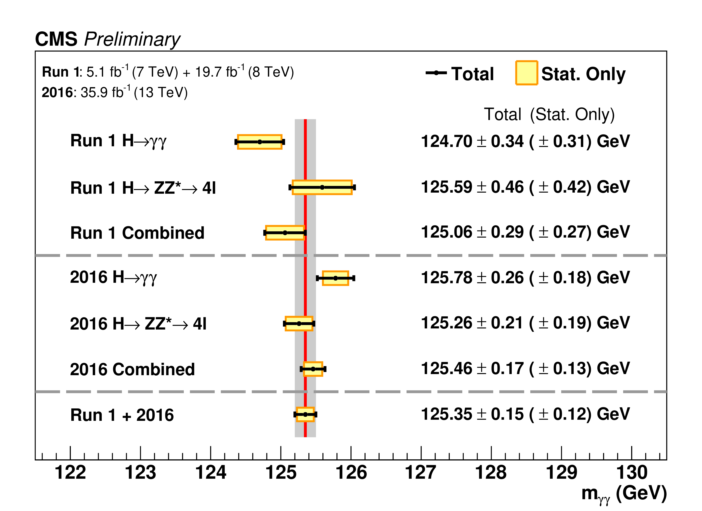](http://cms-results.web.cern.ch/cms-results/public-results/superseded/HIG-19-004/index.html)]

<br>
Make precision measurements
]
.kol-1-3.center[
.width-110[[](https://atlas.web.cern.ch/Atlas/GROUPS/PHYSICS/PAPERS/SUSY-2018-31/)]

Provide constraints on models through setting best limits
]
]

- All require .bold[building statistical models] and .bold[fitting models] to data to perform statistical inference
- Model complexity can be huge for complicated searches
- **Problem:** Time to fit can be .bold[literally days]
- .blue[Goal:] Empower analysts with fast fits and expressive models

---
# Analysis Systems through the lens of pyhf
.center[
.width-75[[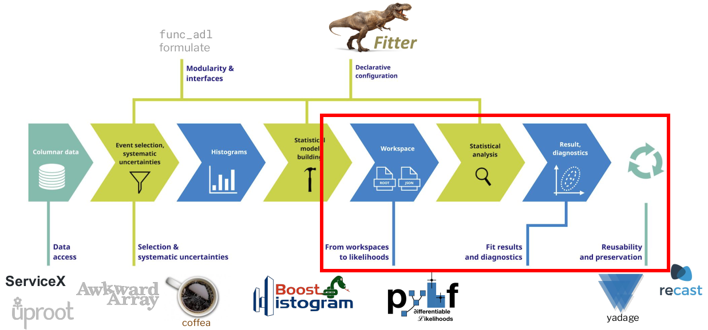](https://iris-hep.org/as.html)]
]
- .large[Accelerating fitting (reducing time to .bold[insight] (statistical inference)!)]
- .large[Flexible schema great for open likelihood .bold[preservation]]
   - .normal[Likelihood serves as high information-density summary of analysis]
- .large[An enabling technology for .bold[reinterpretation]]

---
class: middle

# .center.huge[Accomplishments in Year 2]

---
# Full likelihoods (3) preserved on HEPData

- Background-only model JSON stored
- Signal models stored as JSON Patch files
- Together are able to fully preserve the full model (with own DOI! .width-20[[](https://doi.org/10.17182/hepdata.89408.v1/r2)] )

[.center.width-70[]](https://www.hepdata.net/record/ins1748602)

---
# Publications using pyhf

.kol-1-2.center.width-95[
.center.width-100[[](https://cds.cern.ch/record/2684863)]

.center.width-100[[](https://cds.cern.ch/record/2684863)]
]
.kol-1-2.center.width-100[
.center.width-100[[](https://home.cern/news/news/knowledge-sharing/new-open-release-allows-theorists-explore-lhc-data-new-way)]
]

---
# Rapid adoption in ATLAS...
<!--  -->
.kol-1-2[
- Impressive appetite for `pyhf` in ATLAS analyses
- Much of SUSY, $HH \to 4b$ limit setting
   - Giordon: SUSY Run-2 Summaries subconvener
   - Lukas: ATLAS Modeling Group convener
- Upcoming: ATLAS Stats Forum recommendation
]
.kol-1-2[
<!-- .center.width-100[[](https://www.linkedin.com/in/nicole-hartman-16564b139/)] -->
.italic.smaller[Thanks for making a tool super easy to use!
When I got some [Jupyter] notebooks with this code up and shared with students a lot more of us started including limits in our talks.
Before this was a pretty painful step!]
.center.smaller[&mdash; Nicole Hartman (SLAC), ATLAS Ph.D. Student]
]
.kol-1-1[
.kol-1-1[
.kol-1-2[
.center.width-70[[](https://indico.cern.ch/event/905793/contributions/3811068/)]
]
.kol-1-2[
.center.width-70[[](https://indico.cern.ch/event/905793/contributions/3811068/)]
]
]
.center.smaller[SUSY EWK 3L RPV analysis ([ATLAS-CONF-2020-009](https://atlas.web.cern.ch/Atlas/GROUPS/PHYSICS/CONFNOTES/ATLAS-CONF-2020-009/)): Exclusion curves as a function of mass and branching fraction to $Z$ bosons]
]

---
# ...and by theory

.kol-2-5[
<br>

- [SModelS](https://smodels.github.io/) team has implemented a `SModelS`/`pyhf` interface
   - tool for interpreting simplified-model results from the LHC
   - designed to be used by theorists
- Have produced comparison for .italic[Search for direct stau production in events with two hadronic tau leptons in √s = 13 TeV pp collisions with the ATLAS detector] ([ATLAS-SUSY-2018-04](https://atlas.web.cern.ch/Atlas/GROUPS/PHYSICS/PAPERS/SUSY-2018-04/)) [published likelihood](https://www.hepdata.net/record/ins1765529)
   - Compare simplified likelihood (`SModelS`)
   - to full likelihood (`pyhf`)
]
.kol-3-5[
.center.width-100[[](https://github.com/scikit-hep/pyhf/issues/620#issuecomment-624638428)]

.italic.smaller[
So here is one of our first reasonable validation plots.
It's preliminary, the black line is ATLAS-SUSY-2018-04 official exclusion curve.
The grey line is SModelS using pyhf, running over the published data. &mdash; Wolfgang Waltenberger, CMS/SModelS
]
]

---
# Broader Impact: Upstream contributions

.kol-1-2[
- In working to add `percentile` method across all backends (as part of toys in `v0.5.0`) discovered discrepancy between NumPy implementation and TensorFlow Probability (TFP)
   - Through research between NumPy and TFP source code found a bug in TFP!
   - Confirmed by dev team in discussion on GitHub Issue
   - Agreed with dev team I would write a PR, which was reviewed and merged in timely manner
- Along with Henry and Jim, now have upstream contributions to open source .bold[directly originating] from IRIS-HEP work
- pyhf will .bold[need this bug fix] in the next TFP release, and .bold[thousands] of other projects will benefit
- Bonus: Continuing goodwill development
]
.kol-1-2[
.center.width-100[[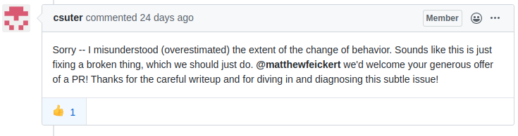](https://github.com/tensorflow/probability/issues/864#issuecomment-620993221)]
<br>
.center.width-100[[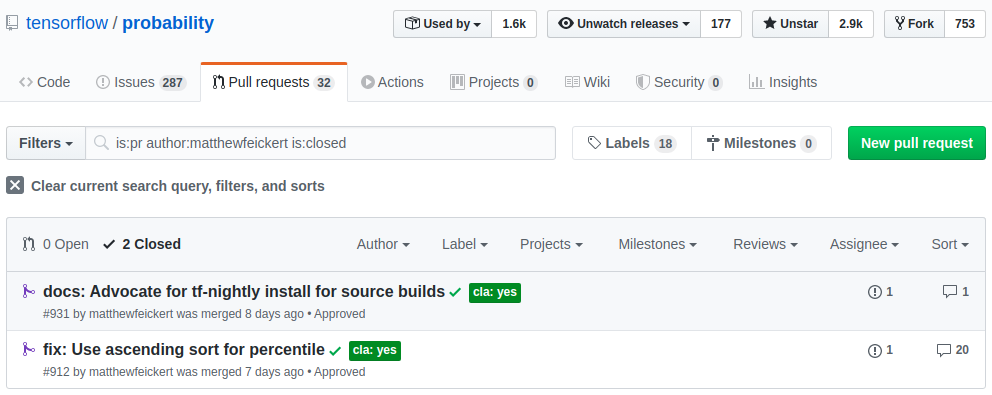](https://github.com/tensorflow/probability/pulls?q=is%3Apr+author%3Amatthewfeickert+is%3Aclosed)]
<br>
.center.width-100[[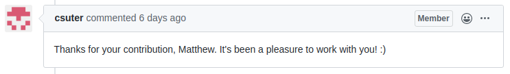](https://github.com/tensorflow/probability/pull/912#issuecomment-629691034)]
]

---
class: middle

# .center.huge[Roadmap for Year 3 Execution]
<!-- each project have a vision for year 3 -->
<!-- - [Gordon's IRIS-HEP year 3 roadmap talk](https://indico.cern.ch/event/914348/contributions/3844844/) -->

---
# In a word: Stability

.center.width-60[[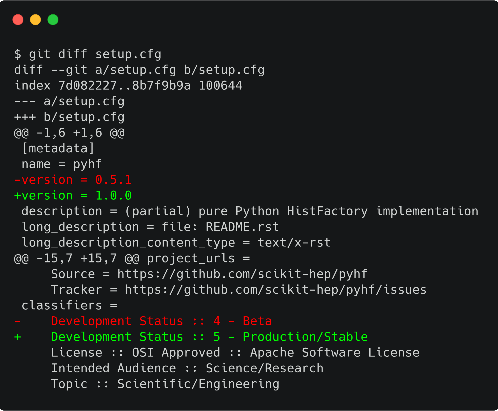](https://scikit-hep.org/pyhf/governance/ROADMAP.html)]

---
# Adoption by analyses

- Any analysis that wants to use `pyhf` for full Run 2 should be able to

.kol-1-2[
.bold[Requirements]:
- `pyhf` becomes mature in its feature set
   - Stat Config
   - Non-asymptotic calculators (toys in `v0.5.0`)
- Validation across all backends against `HistFactory`
   - [`pyhf` GitHub org](https://github.com/pyhf) setup to help streamline process
   - Reproduction of published analyses on HEPData
- Documented examples
   - Case studies
   - Public knowledge base ([`pyhf` Stack Overflow](https://stackoverflow.com/questions/tagged/pyhf))
]
.kol-1-2[
.center.width-100[[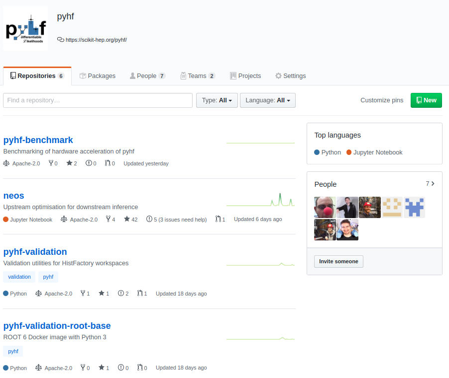](https://github.com/pyhf)]
]

---
# Benchmarking hardware acceleration

.kol-1-2[
.width-60.center[]

- Preliminary results (old) show hardware acceleration giving .bold[order of magnitude speedup] for some models!
- Improvements over traditional
   - 10 hrs to 30 min; 20 min to 10 sec
- Hardware acceleration benchmarking important to find edges
]
.kol-1-2[
.center.width-60[[](https://iris-hep.org/fellows/BoZheng.html)]
.center.width-60[[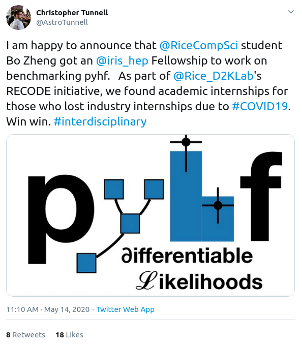](https://twitter.com/AstroTunnell/status/1260965707006857216?s=20)]
]

---
# Integration into Analysis Ecosystems Pipeline
<!--  -->
.center[
.width-55[[](https://iris-hep.org/as.html)]
]
<!--  -->
.kol-1-3[
- Most obvious connections:
   - [ServiceX](https://github.com/ssl-hep/ServiceX): direct data transform and delivery
      - Illlinois team dynamic between Ben and Matthew
   - [`cabinetry`](https://github.com/alexander-held/cabinetry): general interfacing to other tools
      - c.f. [Alex's poster from 2020 Poster Session](https://indico.cern.ch/event/894127/attachments/1996570/3331188/18_-_AS_Final_analysis_stages.pdf) for more details
]
.kol-2-3[
.center.width-90[[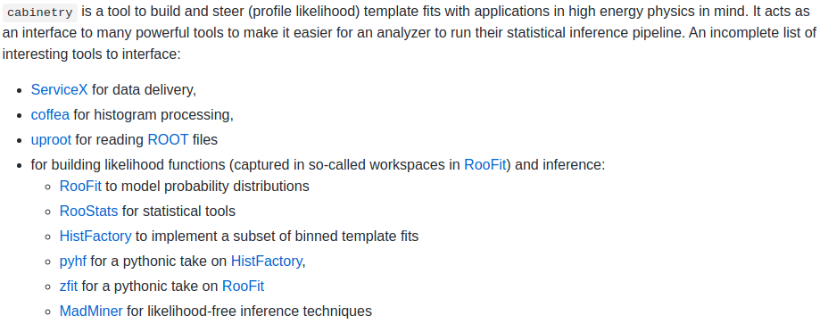](https://github.com/alexander-held/cabinetry)]
]

---
class: middle

# .center.huge[Successful Application: Years 4/5]
<!-- what success looks like in years 4/5 -->
<!-- How is pyhf key to the infrastructure -->

---
# Reducing time to insight: Fitting as a service

`pyhf` HistFactory model spec is pure JSON: Very natural to use a .blue[REST web API] for remote fitting!

<br>

.kol-1-3[
1. `pyhf` installed on different clusters with GPUs around the world
2. User hits a REST API with JSON `pyhf` model as a request
3. `pyhf` fits the workspace on the cluster on demand
4. Returns fit results over REST API to user
]
.kol-2-3[
- Figure out what to show here as some sort of mock code fancied up in Carbon
- ```
curl -H "Content-Type: application/json" \
    -H "Authorization: token OAUTH-TOKEN" \
    --user username \
    --data "@model-spec.json" \
    https://www.endpoint.org/fitting-with-pyhf
```
]


---
# Analysis Reuse: `pyhf` JSON native to HEPData

<br>
.kol-1-2[
- Growing number of analyses publishing full likelihoods to HEPData
- At the moment each likelihood is the collection of many individual signal patch files
- Introduce concept of "patchsets" to reduce all of this two two files:
   - Background only file
   - Signal patchset file
- Would use `hepdata-validator` to resolve all files to inline JSON
- Allows for entire likelihood to be natively supported in HEPData (no more tarballs required)
]
.kol-1-2[
.center.width-100[[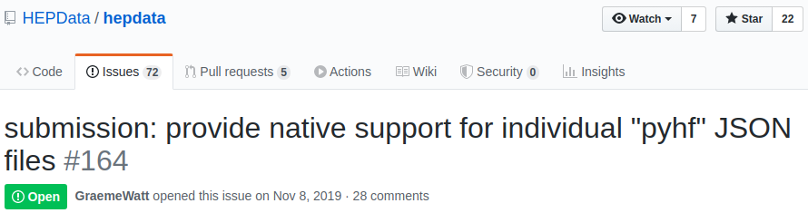](hhttps://github.com/HEPData/hepdata/issues/164)]
<br>
.center.width-100[[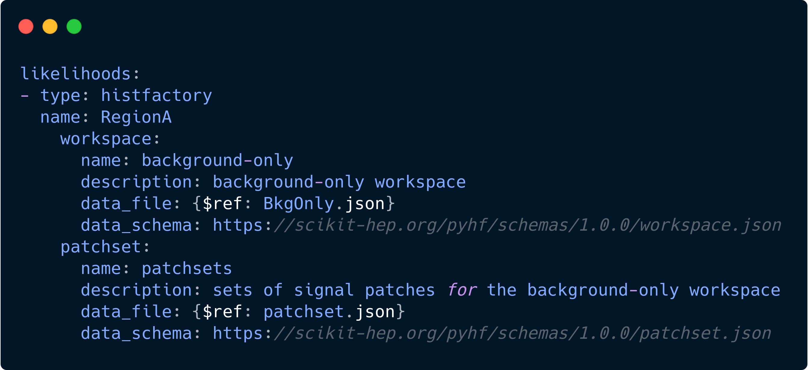](https://github.com/HEPData/hepdata/issues/164#issuecomment-625516324)]
]

---
class: middle

# .center.huge[Grand Challenge Integration]
<!-- How it might (or might not) fit into one of the two grand challenges -->

---
# Analysis Systems Grand Challenge

Following up on [Kyle's presentation yesterday](https://indico.cern.ch/event/896167/contributions/3870075/)

.center[
.width-80[[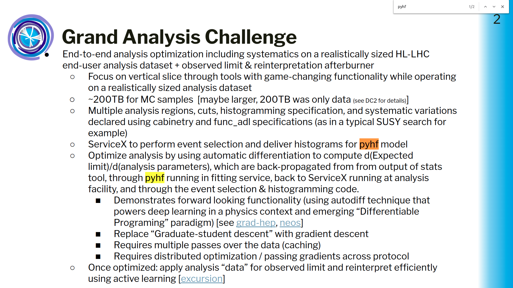](https://docs.google.com/presentation/d/1qrdT0bMvKC6D0ZSGBbNTRLbRi9jBlRi_U367S8l2aCo/edit#slide=id.g857300e35c_0_125)]
]

---
# ServiceX to `pyhf`

<br>
.center[.bold[ServiceX to perform event selection and deliver histograms for .blue[`pyhf` model]]]

<br>
- Should be relatively easy to translate from ServiceX output to `pyhf` JSON model
- Though moving the translation from `pyhf` to `cabinetry` seems like a more robust solution
- `cabinetry` has ability to be a powerful tool, but to `pyhf` translation is most interesting
   - ServiceX to `cabinetry`: data delivery
   - `cabinetry` to `pyhf`: constructing of likelihood
- If useful, Matthew could join contribution efforts

---
# `pyhf`: Fitting as a service

<br>
.center[
.bold[
Optimize analysis by using automatic differentiation to compute $d(\textrm{Expected limit})/d(\textrm{analysis parameters})$, which are back-propagated from from output of stats tool, .blue[through `pyhf` running in fitting service], back to ServiceX running at analysis facility, and through the event selection & histogramming code
]
]

<br>
- As already covered, fitting with `pyhf` can be scaled up on demand and run almost anywhere
   - Local machine, cluster, AWS
- `pyhf` being built on frameworks that automatically handle gradients allows for this to happen naturally
- Should get taken care of as a natural part of `pyhf` development

---
# Summary

.kol-2-3[
- .bold[Accomplishments]
   - Published and preserved full likelihoods
   - Become hugely popular and adopted inside ATLAS
   - Establishing connections for growth with SModelS and HEPData
- .bold[Year 3 Execution]
   - Reach stable API and `v1.0.0` release
   - Provide analysis support
   - Benchmark and profile hardware acceleration benefits
- .bold[Vision for Year 4/5]
   - Globally deployed and scalable "fitting as a service" using REST web API
   - Have native support in HEPData for analysis preservation
- .bold[Grand Challenge]
   - Integrate with `cabinetry` for ServiceX translation
   - Exploit fitting as a service + gradients for differentiable AS pipeline
]
.kol-1-3[
<br><br><br>
.center.width-100[[](https://scikit-hep.org/pyhf/)]
]

---
class: end-slide, center

Backup


---
# HistFactory Template

<br>

$$\begin{aligned}
&\mathcal{P}\left(n\_{c}, x\_{e}, a\_{p} \middle|\phi\_{p}, \alpha\_{p}, \gamma\_{b} \right) = \\\\
&{\color{blue}{\prod\_{c \\,\in\\, \textrm{channels}} \left[\textrm{Pois}\left(n\_{c} \middle| \nu\_{c}\right) \prod\_{e=1}^{n\_{c}} f\_{c}\left(x\_{e} \middle| \vec{\alpha}\right)\right]}} {\color{red}{G\left(L\_{0} \middle| \lambda, \Delta\_{L}\right) \prod\_{p\\, \in\\, \mathbb{S}+\Gamma} f\_{p}\left(a\_{p} \middle| \alpha\_{p}\right)}}
\end{aligned}$$

.bold[Use:] Multiple disjoint _channels_ (or regions) of binned distributions with multiple _samples_ contributing to each with additional (possibly shared) systematics between sample estimates

.bold[Main pieces:]

- .blue[Main Poisson p.d.f. for bins observed in all channels]
- .red[Constraint p.d.f. (+ data) for "auxiliary measurements"]
   - encoding systematic uncertainties (normalization, shape, etc)

---
# References

1. ROOT collaboration, K. Cranmer, G. Lewis, L. Moneta, A. Shibata and W. Verkerke, .italic[[HistFactory: A tool for creating statistical models for use with RooFit and RooStats](http://inspirehep.net/record/1236448)], 2012.
2. L. Heinrich, H. Schulz, J. Turner and Y. Zhou, .italic[[Constraining $A_{4}$ Leptonic Flavour Model Parameters at Colliders and Beyond](https://inspirehep.net/record/1698425)], 2018.

---

class: end-slide, center
count: false

The end.
